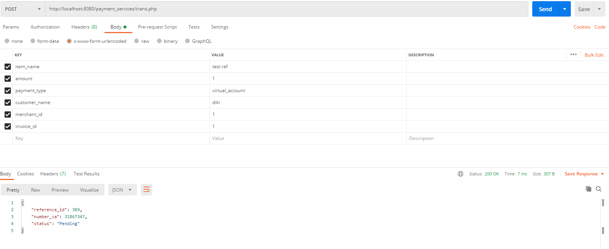
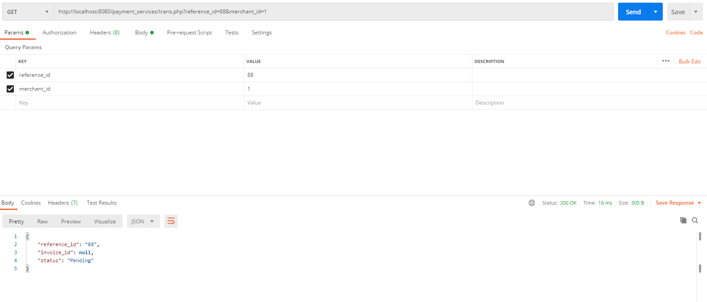

# How to set up application

Cloning git di link berikut : https://github.com/dikiyuliawan/payment_services.git\
Buat database dengan nama payment_services\
Masuk ke folder project yang telah diclone tadi,kemudian di terminal jalankan script untuk migrate/create table: php db_create.php

# How to run application

1. Untuk membuat/create data transaksi pembayaran
   Masukan url http://localhost/payment_services/trans.php di aplikasi Postman dengan metode POST\
   Masukan data yang akan diinsert dengan mengisi key dan value
   

2. Untuk mendapatkan/get status transaksi pembayaran
   Masukan url http://localhost:8080/payment_services/trans.php?reference_id=88&merchant_id=1\
   Sesuaikan isi dari parameter reference_id dan merchant_id berdasarkan data yg ingin ditampilkan
   
